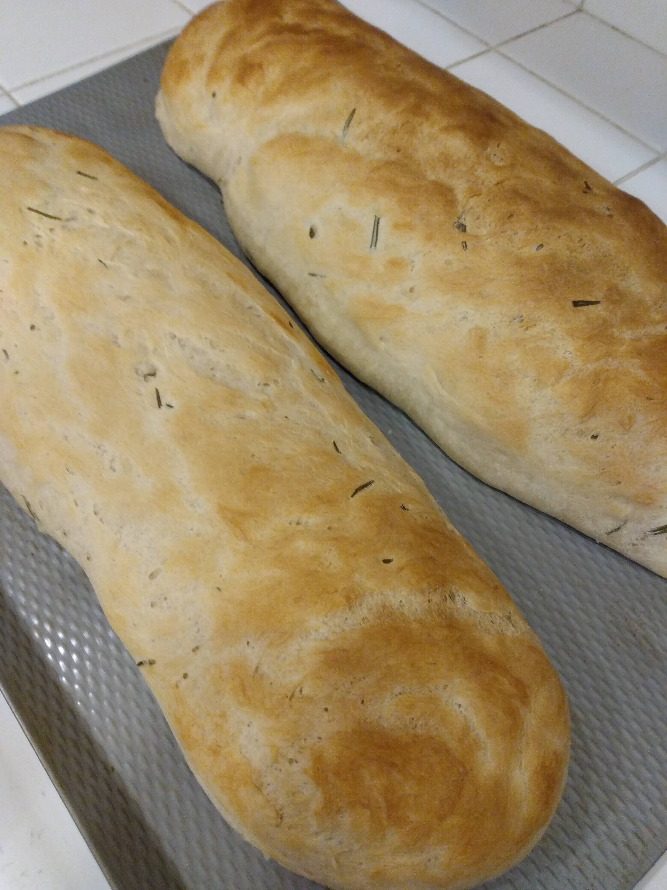

# Bread
> Credit: [https://sallysbakingaddiction.com/homemade-artisan-bread/](https://sallysbakingaddiction.com/homemade-artisan-bread/)

## Serving size
Makes one loaf (you probably want a double batch)

*Above: A double recipe (two loaves) of bread with garlic powder and fresh rosemary*

## Ingredients
* 13/4 cups flour (or bread flour)
* One packet (or 2 tsp) active yeast
* 2 tsp salt
* 3/2 cups water
* Rosemary or other savory add-ins (optional)
* Cornmeal (optional)

## Instructions
Dissolve salt and yeast (and add-ins?) in water. Gradually add flour and knead it a bunch, so that it becomes chewier. Let it rise in a warm place until it's sufficiently poofy -- it should roughly double in size. Letting it rise twice will dontribute to the flavor of the bread. If you're using cornmeal, sprinkle it on a baking sheet to prevent the bread from sticking. Shape the bread and place it on the baking sheet, let it rise a final time in the oven, and then bake it on the bottom shelf of the oven until it sounds hollow. It should be golden-brown on the top. Put a shallow pan of water in the oven along with the bread, so that the steam will protect the crust from getting dry & crusty. The cooking time is around 30 minutes and the temperature is around 450 Fahrenheit, but that will depend on the thickness of the bread.
