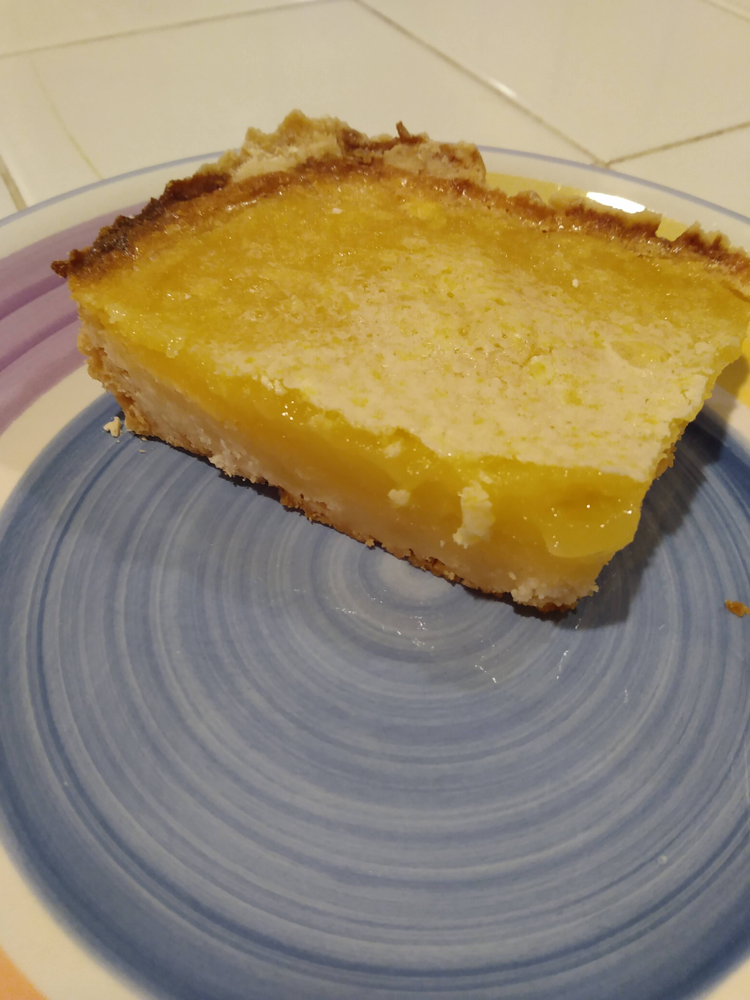

# Lemon bars
> Credit: Based on recipe from [https://www.onceuponachef.com/recipes/luscious-lemon-squares.html](https://www.onceuponachef.com/recipes/luscious-lemon-squares.html)
Serving size: makes one 9"\*13" baking sheet

## Ingredients
### Shortbread crust
* 7/4 cups flour
* 1/4 cup cornstarch
* 1 cup powdered sugar
* 1 cup (2 sticks) butter (salted)

### Custard filling
* 6 eggs
* 3 cups sugar
* 1 cup lemon juice (I used meyer lemons)
* 2/3 cup flour

## Instructions
Cover a 9"\*13" baking dish in Al foil. Mix dry ingredients for crust and toss in chunks of butter. Then throw all that in a food processor (that will be messy) and put the processed stuff in the baking sheet. Press it down to form a uniformly thick crust, then refrigerate that for a while (half an hour? idk). Then bake it at 350F until it's lightly goldened, about 20 minutes. For the filling, just whisk everything together, and try as hard as you can to destroy lumps of flour. When the crust is toasted, pour the filling in and bake at the same temperature (350F) until it's firm, roughly 30 minutes. You'll know it's done once it looks done and tilting the baking dish doesn't make the filling slosh around at all. Cool at room temperature once done, then refrigerate until you're ready to eat it.
